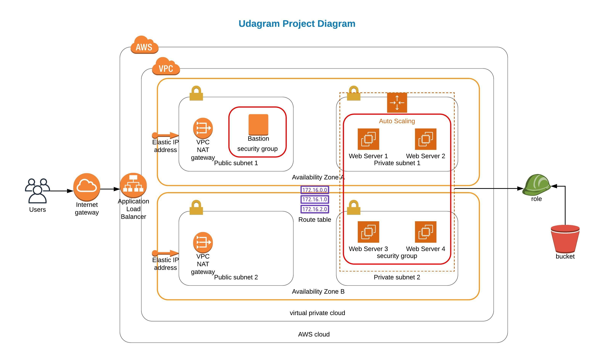

# Deploy a high-availability Web Application using AWS CloudFormation 


## Description 

The purpose of this project is to deploy a high-availability web app using AWS CloudFormation .
The template code will create and deploy the infrastructure and application for an Instagram-like app ***Udagram*** from the ground up.
It will begin with deploying the networking components, followed by servers, security roles and software.

* Application Load Balancer URL : http://Udagr-WebAp-TK1FGF38MDB4-54264505.us-west-2.elb.amazonaws.com


## Prerequisites:

* AWS Account
* AWS Command Line Interface (AWS CLI)


## Architecture Diagram :




## Configuring the AWS Command Line Interface (CLI)

* Download and install the [AWS CLI tool](https://aws.amazon.com/cli/).
* In the terminal, type `aws --version`: this verifies that you have the AWS CLI tool.
* To set up your AWS CLI, type `aws configure` in the terminal. Next when prompted for the AWS Access Key ID, paste in `your Secret access key`.
* Region: Please use `us-west-2`, even if you’re living closer to another available region.


## Instructions


* First, create the network by running the `create-stack.sh` file in the terminal, as shown below:

```./create-stack.sh UdagramNetwork Udagram-network.yml network-params.json```

* Then, create the Web servers by running the `create-stack.sh` file in the terminal, as shown below :

```./create-stack.sh UdagramServers Udagram-servers.yml servers-params.json```

* If you want to create The bastion host, run the `create-stack.sh`file in the terminal, as shown below. Make sure to update the bastion-params file with your own ***Key Pair name***

```./create-stack.sh UdagramBastion Udagram-bastion.yml bastion-params.json```


  
## Authors

* **Mohamed BOUSETTA MAHJOUB** - *Initial work* - [MedMahj](https://github.com/MedMahj/)


